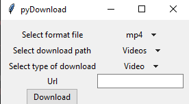
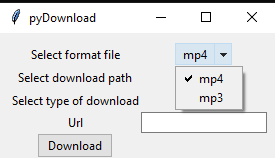
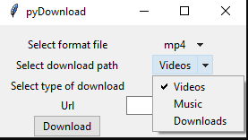
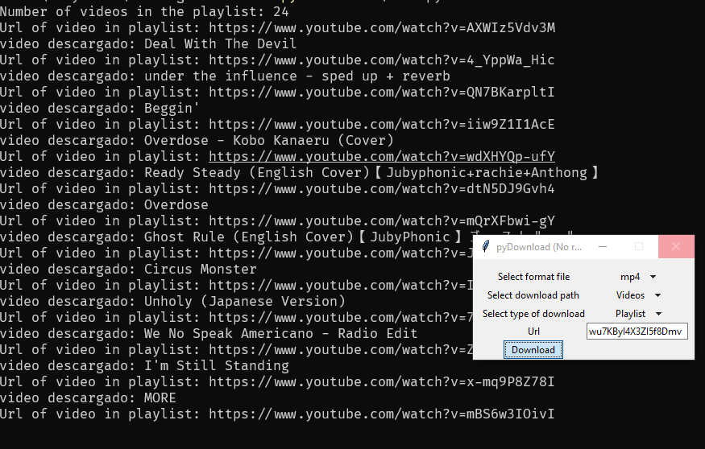

# pyDownload
## `This a little downloader for playlist and videos of` [Youtube](sa)

## Image
### Simple GUI

### Simples Options

### Simple downloads

## Build from scratch

- ### Windows
~~~pws
cd pyDownload
python main.py
~~~

- ### Linux
~~~pws
cd pyDownload && python3 main.py
~~~